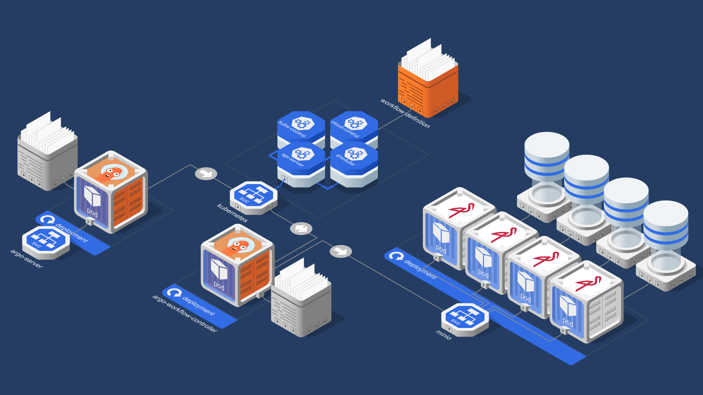
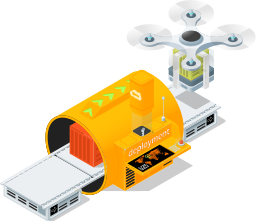
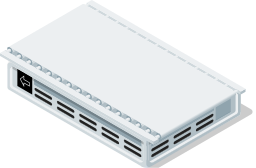
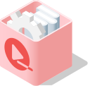
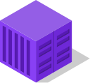
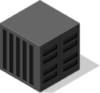
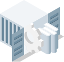
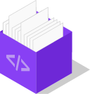
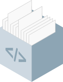
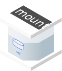

# Cloud Native isometric icons

Talking about Cloud Native and Continous delevery concepts can be challenging when the time come to talk to non-technical people.
We beleive that using isometry helps to handle the various dimensions of distributed systems, espectially those running in Kubernetes.

---

---

## History & Goals

This project started when we realized how boring it is to represent a fully-featured microservices application like [Spinnaker](https://www.spinnaker.io). Espcially when it comes to display how it looks like when Deployed using the Helm charts.
The number of objects and customisation is so high that diagrams was looking like an indigestible spaghetti plate.

Isometry offers this opportunity to represent the various objects in volumes and gain a better understanting impact when promotting [Cloud Native](https://cncf.io) projects and the assiociated Devops spirit.

## License

Please note those assets are distributed under a creative commons license, you are permitted to use and share this work providing usage is attributed to `Florian JUDITH` and `Marie DAO`. And that the original file is distributed with this README file.

This work is licensed under the Creative Commons Attribution-NoDerivatives 4.0 International License. To view a copy of this license, visit <http://creativecommons.org/licenses/by-nd/4.0/deed.en_US>.

###### Software Factory

<table width='90%'>
<tr align='center'>
    <td align='center'></td>
    <td align='center'></td>
    <td align='center'></td>
    <td align='center'></td>
</tr>
<tr align='center'>
    <td align='center'></td>
    <td align='center'></td>
    <td align='center'></td>
    <td align='center'></td>
</tr>
<tr align='center'>
    <td align='center'></td>
    <td align='center'></td>
    <td align='center'></td>
    <td align='center'></td>
</tr>
</table>

###### Kubernetes control-plane

<table width='90%'>
<tr align='center'>
    <td align='center'></td>
    <td align='center'></td>
    <td align='center'></td>
    <td align='center'></td>
</tr>
<tr align='center'>
    <td align='center'></td>
    <td align='center'></td>

</tr>
</table>

###### Kubernetes infrastructure

<table width='90%'>
<tr align='center'>
    <td align='center'></td>
    <td align='center'></td>
    <td align='center'></td>
</tr>
</table>

###### Kubernetes pod

<table width='90%'>
<tr align='center'>
    <td align='center'></td>
    <td align='center'></td>
    <td align='center'></td>
    <td align='center'></td>
    <td align='center'></td>
</tr>
</table>

###### Application Package

<table width='90%'>
<tr align='center'>
    <td align='center'></td>
    <td align='center'></td>
    <td align='center'></td>
    <td align='center'></td>
    <td align='center'></td>
</tr>
<tr align='center'>
    <td align='center'></td>
    <td align='center'></td>
    <td align='center'></td>
    <td align='center'></td>
    <td align='center'></td>
</tr>
<tr align='center'>
    <td align='center'></td>
    <td align='center'></td>
    <td align='center'></td>
    <td align='center'></td>
    <td align='center'></td>
</tr>
<tr align='center'>
    <td align='center'></td>
    <td align='center'></td>
    <td align='center'></td>
    <td align='center'></td>
</tr>
</table>

###### Application package (Material)

<table width='90%'>
<tr align='center'>
    <td align='center'></td>
    <td align='center'></td>
    <td align='center'></td>
    <td align='center'></td>
    <td align='center'></td>
    <td align='center'></td>
    <td align='center'></td>
    <td align='center'></td>
</tr>
<tr align='center'>
    <td align='center'></td>
    <td align='center'></td>
    <td align='center'></td>
    <td align='center'></td>
    <td align='center'></td>
    <td align='center'></td>
    <td align='center'></td>
    <td align='center'></td>
</tr>
<tr align='center'>
    <td align='center'></td>
    <td align='center'></td>
    <td align='center'></td>
    <td align='center'></td>
    <td align='center'></td>
    <td align='center'></td>
    <td align='center'></td>
    <td align='center'></td>
</tr>
<tr align='center'>
    <td align='center'></td>
    <td align='center'></td>
    <td align='center'></td>
    <td align='center'></td>
    <td align='center'></td>
    <td align='center'></td>
    <td align='center'></td>
    <td align='center'></td>
</tr>
<tr align='center'>
    <td align='center'></td>
    <td align='center'></td>
    <td align='center'></td>
    <td align='center'></td>
    <td align='center'></td>
    <td align='center'></td>
    <td align='center'></td>
    <td align='center'></td>
</tr>
</table>

###### Cloud (Front view)

<table width='90%'>
<tr align='center'>
    <td align='center'></td>
    <td align='center'></td>
    <td align='center'></td>
    <td align='center'></td>
    <td align='center'></td>
</tr>
</table>

<table width='90%'>
<tr align='center'>
    <td align='center'></td>
    <td align='center'></td>
    <td align='center'></td>
    <td align='center'></td>
    <td align='center'></td>
</tr>
<tr align='center'>
    <td align='center'></td>
    <td align='center'></td>
    <td align='center'></td>
    <td align='center'></td>
    <td align='center'></td>
</tr>
<tr align='center'>
    <td align='center'></td>
    <td align='center'></td>
    <td align='center'></td>
    <td align='center'></td>
</tr>
</table>

###### Cloud (Side view)

<table width='90%'>
<tr align='center'>
    <td align='center'></td>
    <td align='center'></td>
    <td align='center'></td>
    <td align='center'></td>
    <td align='center'></td>
</tr>
</table>

<table width='90%'>
<tr align='center'>
    <td align='center'></td>
    <td align='center'></td>
    <td align='center'></td>
    <td align='center'></td>
    <td align='center'></td>
</tr>
<tr align='center'>
    <td align='center'></td>
    <td align='center'></td>
    <td align='center'></td>
    <td align='center'></td>
    <td align='center'></td>
</tr>
<tr align='center'>
    <td align='center'></td>
    <td align='center'></td>
    <td align='center'></td>
    <td align='center'></td>
</tr>
</table>

###### Container

<table width='90%'>
<tr align='center'>
    <td align='center'></td>
    <td align='center'></td>
    <td align='center'></td>
    <td align='center'></td>
    <td align='center'></td>
</tr>
<tr align='center'>
    <td align='center'></td>
    <td align='center'></td>
    <td align='center'></td>
    <td align='center'></td>
    <td align='center'></td>
</tr>
<tr align='center'>
    <td align='center'></td>
    <td align='center'></td>
    <td align='center'></td>
    <td align='center'></td>
    <td align='center'></td>
</tr>
<tr align='center'>
    <td align='center'></td>
    <td align='center'></td>
    <td align='center'></td>
    <td align='center'></td>
    <td align='center'></td>
</tr>
<tr align='center'>
    <td align='center'></td>
    <td align='center'></td>
    <td align='center'></td>
</tr>
</table>

###### Container (Material)

<table width='90%'>
<tr align='center'>
    <td align='center'></td>
    <td align='center'></td>
    <td align='center'></td>
    <td align='center'></td>
    <td align='center'></td>
    <td align='center'></td>
    <td align='center'></td>
    <td align='center'></td>
</tr>
<tr align='center'>
    <td align='center'></td>
    <td align='center'></td>
    <td align='center'></td>
    <td align='center'></td>
    <td align='center'></td>
    <td align='center'></td>
    <td align='center'></td>
    <td align='center'></td>
</tr>
<tr align='center'>
    <td align='center'></td>
    <td align='center'></td>
    <td align='center'></td>
    <td align='center'></td>
    <td align='center'></td>
    <td align='center'></td>
    <td align='center'></td>
    <td align='center'></td>
</tr>
<tr align='center'>
    <td align='center'></td>
    <td align='center'></td>
    <td align='center'></td>
    <td align='center'></td>
    <td align='center'></td>
    <td align='center'></td>
    <td align='center'></td>
    <td align='center'></td>
</tr>
<tr align='center'>
    <td align='center'></td>
    <td align='center'></td>
    <td align='center'></td>
    <td align='center'></td>
    <td align='center'></td>
    <td align='center'></td>
    <td align='center'></td>
    <td align='center'></td>
</tr>
</table>

###### Configuration

<table width='90%'>
<tr align='center'>
    <td align='center'></td>
    <td align='center'></td>
    <td align='center'></td>
    <td align='center'></td>
    <td align='center'></td>
</tr>
<tr align='center'>
    <td align='center'></td>
    <td align='center'></td>
    <td align='center'></td>
    <td align='center'></td>
    <td align='center'></td>
</tr>
<tr align='center'>
    <td align='center'></td>
    <td align='center'></td>
    <td align='center'></td>
    <td align='center'></td>
    <td align='center'></td>
</tr>
<tr align='center'>
    <td align='center'></td>
</tr>
</table>

###### Code

<table width='90%'>
<tr align='center'>
    <td align='center'></td>
    <td align='center'></td>
    <td align='center'></td>
    <td align='center'></td>
    <td align='center'></td>
</tr>
<tr align='center'>
    <td align='center'></td>
    <td align='center'></td>
    <td align='center'></td>
    <td align='center'></td>
    <td align='center'></td>
</tr>
<tr align='center'>
    <td align='center'></td>
    <td align='center'></td>
    <td align='center'></td>
    <td align='center'></td>
    <td align='center'></td>
</tr>
<tr align='center'>
    <td align='center'></td>
</tr>
</table>

###### Filesystem

<table width='90%'>
<tr align='center'>
    <td align='center'></td>
    <td align='center'></td>
    <td align='center'></td>
    <td align='center'></td>
    <td align='center'></td>
</tr>
</table>

###### Object storage

<table width='90%'>
<tr align='center'>
    <td align='center'></td>
</tr>
</table>

###### Kubernetes config and storage

<table width='90%'>
<tr align='center'>
    <td align='center'></td>
    <td align='center'></td>
    <td align='center'></td>
    <td align='center'></td>
    <td align='center'></td>
</tr>
<tr align='center'>
    <td align='center'></td>
</tr>
</table>

###### Kubernetes workloads

<table width='90%'>
<tr align='center'>
    <td align='center'></td>
    <td align='center'></td>
    <td align='center'></td>
    <td align='center'></td>
    <td align='center'></td>
</tr>
<tr align='center'>
    <td align='center'></td>
    <td align='center'></td>
    <td align='center'></td>
    <td align='center'></td>
    <td align='center'></td>
</tr>
</table>

###### Kubernetes discovery and load balancing

<table width='90%'>
<tr align='center'>
    <td align='center'></td>
    <td align='center'></td>
</tr>
</table>

###### Networking

<table width='90%'>
<tr align='center'>
    <td align='center'></td>
    <td align='center'></td>
    <td align='center'></td>
</tr>
</table>

###### Repository

<table width='90%'>
<tr align='center'>
    <td align='center'></td>
    <td align='center'></td>
    <td align='center'></td>
</tr>
</table>

###### Server

<table width='90%'>
<tr align='center'>
    <td align='center'></td>
    <td align='center'></td>
    <td align='center'></td>
    <td align='center'></td>
    <td align='center'></td>
</tr>
<tr align='center'>
    <td align='center'></td>
    <td align='center'></td>
    <td align='center'></td>
    <td align='center'></td>
    <td align='center'></td>
</tr>
</table>

###### Rack

<table width='90%'>
<tr align='center'>
    <td align='center'></td>
    <td align='center'></td>
</tr>
</table>

###### Vulnerability scanner

<table width='90%'>
<tr align='center'>
    <td align='center'></td>
    <td align='center'></td>
    <td align='center'></td>
    <td align='center'></td>
</tr>
</table>

## Tools

The project started using [Inkscape](https://inkspace.org), but we switched to [Affinity Designer](https://affinity.serif.com) as we discovered that GPU acceleration was the key to resolve the performance issues we faced when building complex diagrams.

## contributors

- [@fjudith](https://github.com/fjudith) - IT architect, SRE, Graphic designer (somehow)
- [@mariedao](https://github.com/mariedao) - Graphic designer and Tae kondo master

## Credits and Inspiration 

Most of the icons are originals and crafted night after night.
However we wanted also wants to give credits to awsome projects we crossed when we were searching for inspirations.

-  [Kubernetes Icons](https://github.com/kubernetes/community/tree/master/icons) from [CNCF](https://cncf.io) - [Github](https://github.com/cncf)
-  [Nvidia Docker](https://devblogs.nvidia.com/gpu-containers-runtime) from [Nvidia](https://nvidia.com) - [Github](https://github.com/nvidia)
-  [Prisma](<https://www.prisma.io>) - [Github](prisma)
-  [Portal 2 - Apperture Science commercials](https://www.youtube.com/playlist?list=PL8kpaSMMKX77pkOQzuZfuL3wtX0kvKW3u) from [Valve](https://www.valvesoftware.com) - [Github](https://github.com/ValveSoftware)
-  [Cloudcraft](https://cloudcraft.com)
-  [Arcentry](https://arcentry.com)

### Special thanks

-  [Onepoint](https://groupeonepoint.com)
