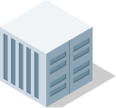
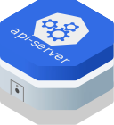
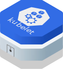
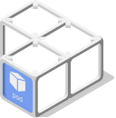
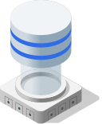

# Cloud Native isometric icons

Talking about Cloud Native and Continous delevery concepts can be challenging when the time come to talk to non-technical people.
We beleive that using isometry helps to handle the various dimensions of distributed systems, espectially those running in Kubernetes.

---

---

## History & Goals

This project started when we realized how boring it is to represent a fully-featured microservices application like [Spinnaker](https://www.spinnaker.io). Espcially when it comes to display how it looks like when Deployed using the Helm charts.
The number of objects and customisation is so high that diagrams was looking like an indigestible spaghetti plate.

Isometry offers this opportunity to represent the various objects in volumes and gain a better understanting impact when promotting [Cloud Native](https://cncf.io) projects and the assiociated Devops spirit.

## Assets

### Application Package

### Cloud

#### Front view

#### Side view

### Container

#### Basic

#### Colored

#### Tone

### Filesystem

### Kubernetes

#### Control plane

#### Infrastructure

#### Resources

##### Pod

##### Config and Storage

##### Workloads (blue)

##### Workloads (gray)

##### Discovery and Load Balancing

### Networking

### Repository

### Server

#### Rack

### Vulnerability scanner

## Tools we used

The project started using [Inkscape](https://inkspace.org), but we switched to [Affinity Designer](https://affinity.serif.com) as we discovered that GPU acceleration was the key to resolve the performance issues we faced when building complex diagrams.

## contributors

- [@fjudith](https://github.com/fjudith) - IT architect, SRE, Graphic designer (somehow)
- [@mariedao](https://github.com/mariedao) - Graphic designer and Tae kondo master

## Credits and Inspiration 

Most of the icons are originals and crafted night after night.
However we wanted also wants to give credits to awsome projects we crossed when we were searching for inspirations.

-  [Kubernetes Icons](https://github.com/kubernetes/community/tree/master/icons) from [CNCF](https://cncf.io) - [Github](https://github.com/cncf)
-  [Nvidia Docker](https://devblogs.nvidia.com/gpu-containers-runtime) from [Nvidia](https://nvidia.com) - [Github](https://github.com/nvidia)
-  [Prisma](<https://www.prisma.io>) - [Github](prisma)
-  [Portal 2 - Apperture Science commercials](https://www.youtube.com/playlist?list=PL8kpaSMMKX77pkOQzuZfuL3wtX0kvKW3u) from [Valve](https://www.valvesoftware.com) - [Github](https://github.com/ValveSoftware)
-  [Cloudcraft](https://cloudcraft.com)
-  [Arcentry](https://arcentry.com)

### Special thanks

 [Onepoint](https://groupeonepoint.com)

## License

The Kubernetes Icons Set is licensed under a choice of either Apache-2.0 or CC-BY-4.0 (Creative Commons Attribution 4.0 International). The Kubernetes logo is a registered trademark of The Linux Foundation, and use of it as a trademark is subject to The Linux Foundation's Trademark Usage Guidelines at https://www.linuxfoundation.org/trademark-usage/.